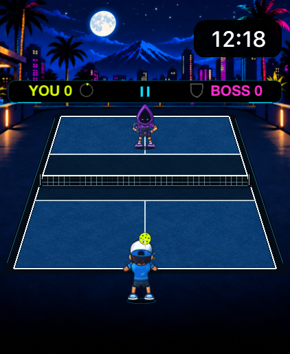
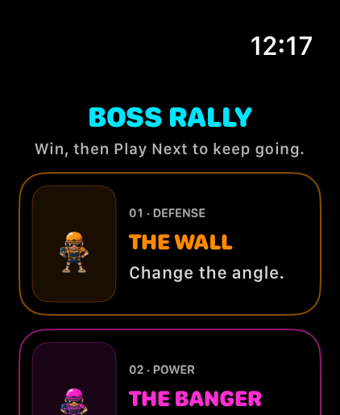
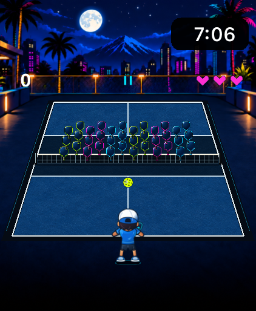

# PickleBlast

**Neon pickleball, made for Apple Watch.** Move with the Digital Crown, return automatically, and play quick rallies against five distinct bosses.

[Website](https://fcw1987.github.io/PickleBlast/) · [Privacy](https://fcw1987.github.io/PickleBlast/privacy/) · [Support](https://fcw1987.github.io/PickleBlast/support/)

<a href="docs/images/boss-rally.png"></a>
<a href="docs/images/opponents.png"></a>
<a href="docs/images/arcade.png"></a>

These historical captures show version 1.0 (4) in the watchOS 27.0 simulator. They predate the five-boss roster and build 6 navigation and presentation; replacement captures are pending. See [screenshot provenance](docs/images/README.md).

## Play

Turn the Digital Crown or drag on the court to move. Your player returns the ball automatically; your position shapes the shot. The court glows against a true-black background, with a neon OLED-focused look.

**Boss Rally** appears first on Home. Choose The Wall, The Banger, The Poacher, The Dinker, or The Lobber individually. After a win, **Play Next** offers the next opponent in that displayed order. The Lobber ends the list without looping; Rematch, Choose Opponent, and Home remain available. Each match is first to three points, with two saves. The Wall rewards placement, The Banger presses the pace, and The Poacher commits to a side from your shot tendencies. The Dinker mixes in soft resets; The Lobber sends elevated shots back to your normal receiving area. Your wins, best score, and longest rally for each boss stay on your Watch.

**Arcade** appears below Boss Rally and offers three target waves followed by a final rally against The Wall. Your best score is stored locally.

## Build and run

For the owner or an otherwise authorized developer: PickleBlast is a standalone watchOS app with a deployment target of watchOS 10.0. The verified local toolchain is full Xcode 27 with Swift 6.4. The project has been built on current Watch simulators; the minimum-version target does not mean every older Watch and watchOS release has been tested.

Open `PickleBlast.xcodeproj`, choose the **PickleBlast** scheme, select an Apple Watch simulator, and run. To check a clean checkout from Terminal:

```sh
python3 scripts/generate_project.py --check
python3 scripts/import_art.py --check-runtime
bash scripts/test.sh
bash scripts/validate.sh
```

The full validation script requires full Xcode for its native Watch build and reports when that toolchain is unavailable. See [Build and test](docs/BUILD_AND_TEST.md) for detailed simulator, UI test, and local signing instructions.

## Project structure

SwiftUI provides the menus, settings, pause, and results. The pure Swift `PickleBlastCore` owns gameplay positions, collisions, scores, timers, and transitions. SpriteKit renders the core's state; it does not simulate gameplay. See [Architecture](docs/ARCHITECTURE.md).

- `Sources/PickleBlastCore` — authoritative game rules and state.
- `Sources/PickleBlastRendering` — court projection, SpriteKit scene, and presentation.
- `WatchApp` — watchOS interface, session, settings, and bundled runtime artwork.
- `Tests` and `WatchUITests` — core, host, and Watch UI test sources.
- `docs` — product, build, architecture, artwork, CI, and release-readiness guides.
- `scripts` — project generation, asset checks, and validation.

## Privacy and status

Game settings and records are stored in the app's local storage. PickleBlast works offline and has no account, gameplay server, analytics, advertising, or user-tracking integration. Apple system services follow Apple's own policies; see [Privacy](PRIVACY.md) for the app's inspected behavior.

The current polish candidate is version 1.0 (6), awaiting independent user testing and acceptance. PickleBlast has not been released through the App Store or TestFlight. [App Store readiness](docs/APP_STORE_READINESS.md) describes the outstanding work.

## Issues, security, and rights

Use GitHub Issues to report bugs or request features. The project does not accept code or artwork contributions or pull requests; see [Contributing](CONTRIBUTING.md). Report security concerns privately as described in [Security](SECURITY.md), never in a public issue.

PickleBlast is **source available, not open source**. The source is provided for viewing, study, discussion, and evaluation. Repository access does not grant permission for personal or commercial use, execution, modification, redistribution, derivative works, republishing, or incorporation into another project without prior written authorization. Authorized distributed copies are governed by their applicable end user license. Artwork, characters, animations, name, and branding are also all rights reserved. See [Source license](LICENSE.md), [Asset license](ASSET_LICENSE.md), [Privacy](PRIVACY.md), and [Artwork and runtime assets](docs/ART_ASSETS.md).

## Guides

[Product specification](docs/PRODUCT_SPEC.md) · [Build and test](docs/BUILD_AND_TEST.md) · [Architecture](docs/ARCHITECTURE.md) · [Artwork and runtime assets](docs/ART_ASSETS.md) · [CI](docs/CI.md) · [App Store readiness](docs/APP_STORE_READINESS.md)
