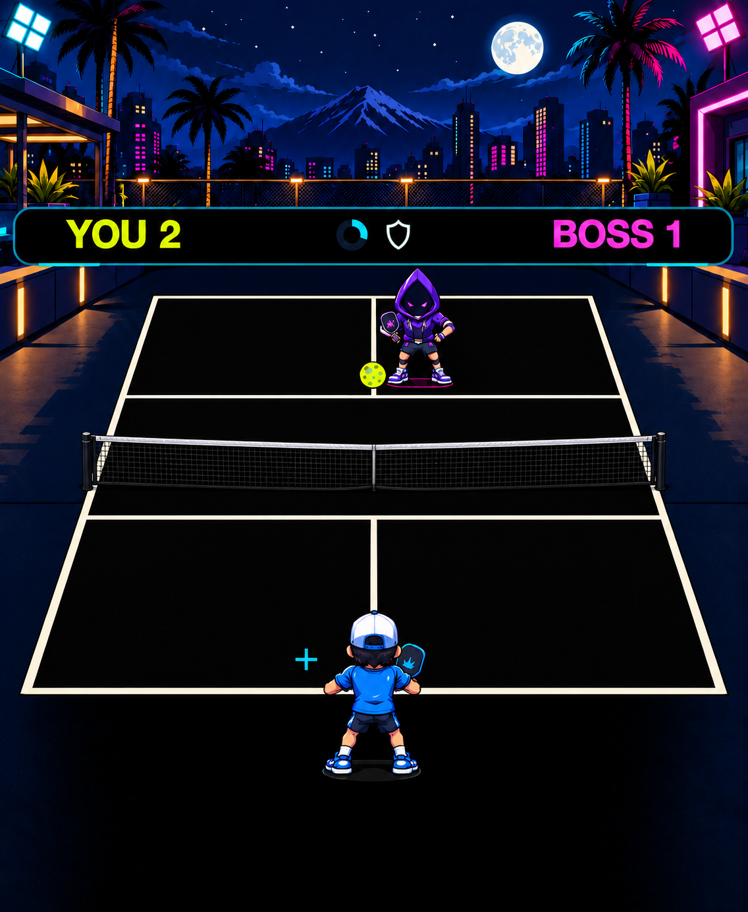
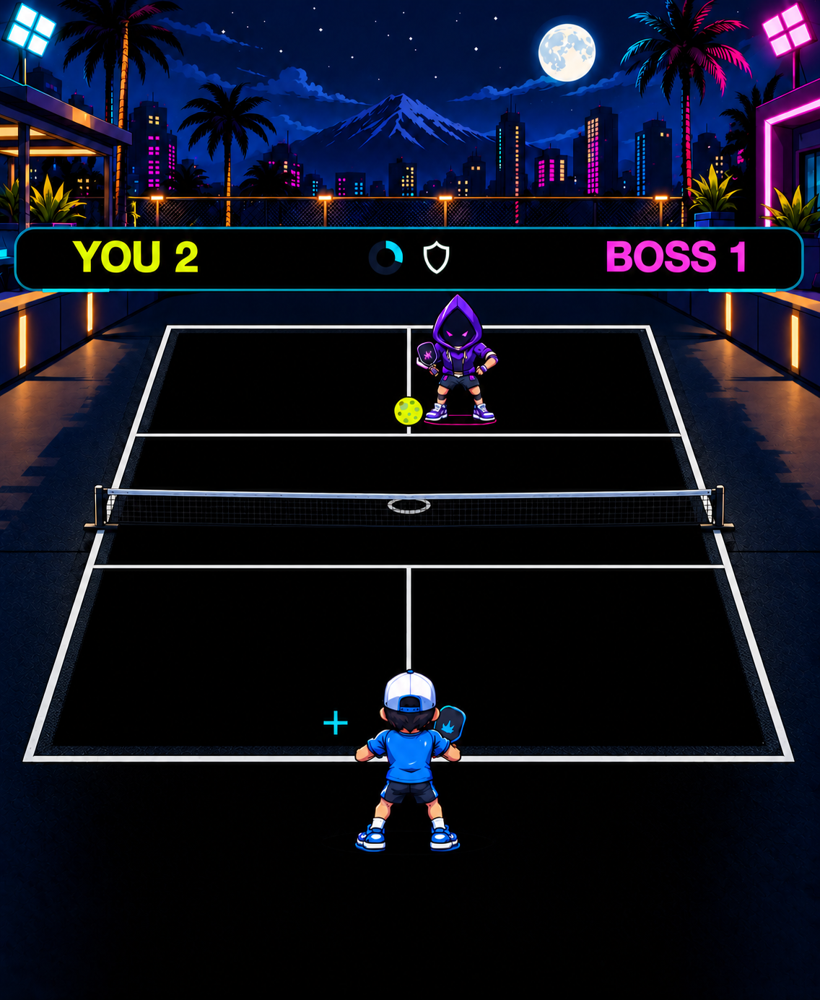
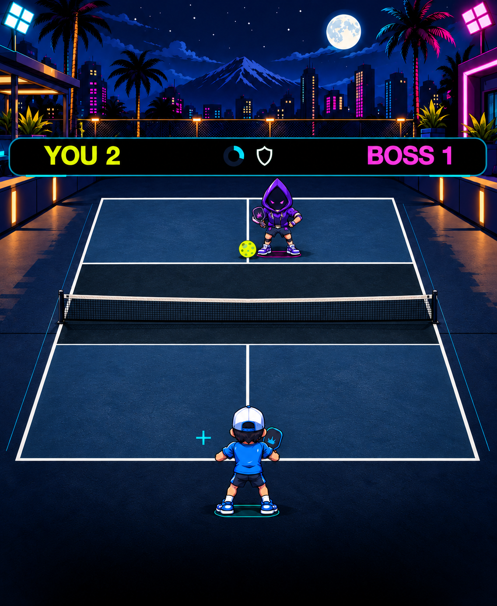

# B — Court directions

The selected **Cel Sports Comic** direction keeps its characters, skyline and side surroundings. These three proposals explore the central playing court. **Every image here is generated concept art, including the selected B reference. None is an in-engine screenshot or an installed build.** **The user selected B3 and explicitly approved its blue playing surface.** The comparisons below preserve the options considered before that selection.

## Matching 40 mm previews

Each complete image displays at 162 × 197 CSS pixels. This is a static display reduction, not a separately reflowed small-Watch layout or a physical-size guarantee.

| Selected B reference | B1 · Precision Championship | B2 · Velvet Blacktop | B3 · Slate Competition |
| --- | --- | --- | --- |
|  |  |  |  |
| Approved direction reference | Black-court intent | Black-court intent | **Selected blue surface** |

## B1 · Precision Championship

Painted ivory regulation markings and a constructed fabric-and-mesh net replace the luminous wireframe treatment. The empty center stays visually quiet. This is the clarity-first end of the range; most of the change is in the net and line materials.

The generated surface is near-black, not exact RGB(0,0,0). The deeper net hides the gray oval depth cue. A playable version must use the engine's exact black fill and preserve that cue's visibility.

## B2 · Velvet Blacktop

A narrow material border, cooler paint, slimmer physical net and compact grounding add depth around a black center. A refinement removed an overtextured first draft and restored the gray oval cue. B2 was the review recommendation while retaining a true-black court; the user subsequently chose B3 for its stronger central-surface change.

Most sampled interior pixels are exact black; this is a spot check, not a measurement of whole-court black coverage. The narrow textured edge adds illuminated pixels and must remain subordinate to lines and ball. The gameplay renderer remains responsible for exact RGB0 fill, accurate geometry and cues.

## B3 · Slate Competition — explicit OLED tradeoff

Blue acrylic service boxes and a darker kitchen create the largest central-surface change. The lime ball and white markings remain clear in the static concept. **The user explicitly approved this replacement of true-black court pixels with a colored surface when selecting B3.**

The gray oval cue is missing under the generated net and the cyan cross has less contrast against blue. Both must be corrected in the B3 playable proof. Surface coverage and pixel brightness differ substantially from the black options; no battery or GPU claim follows from this mockup.

## Review findings and implementation boundary

- Full-resolution images were visually reviewed twice, including independent review. The overall character footprints, poses, framing, ball position and service/kitchen line topology appear preserved. Generated images cannot prove exact regulation dimensions, contact registration or animation readability.
- Interior pixel spot checks found B1 median RGB(4,3,3), refined B2 median RGB(0,0,0), and B3 median RGB(24,61,105). Refined B2 had 78.6% exact black within those sampled patches. These are image samples, not whole-court coverage or display-power measurements.
- The small previews are CSS reductions. No new native Watch capture, runtime asset pack, device installation or performance test was produced for these concepts.
- Retain authoritative engine court lines, ball trajectories, landing/depth cues and character timing. Never install one of these complete screenshots as a runtime background.
- The selected B3 style is being implemented with existing SpriteKit geometry and separately generated original environment/material assets. More detailed mesh or painted surface does not justify runtime shaders or a new dependency by itself. Frame cadence, memory, first load and repeated-match behavior must be measured in the playable proof.

## Provenance

Original images generated using the built-in ImageGen tool by editing the selected [B concept](../visual-directions/README.md). [Generation record](generation-record.json) contains the exact initial and B2 refinement prompts; identical reruns are not guaranteed. [Manifest](manifest.json) records original final PNG dimensions, sizes and hashes.

B3's unaltered original is stored under ArtSources because it exceeds the public site's 2 MiB per-file limit. The limit and PNG pixels remain unchanged. Individual PNGs and a self-contained comparison gallery are also saved to Library for review.
