# B3 — Native Watch and renderer comparison

Build 8 uses exact runtime commit `e45c612bcfc44922aa4897b42c16085b225eab6a`. The selected B3 slate-blue court and B illustrated surroundings are separate production layers beneath the existing game and character animations. Physical user acceptance remains pending.

## Actual native Watch screenshots

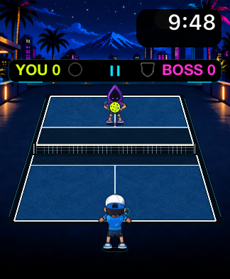
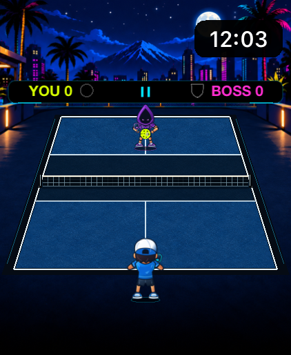

These native watchOS 27 captures come from ordinary boss selection and the unchanged automatic-return game. They include the real system clock and Pause overlay. The clock's bounded black backing keeps white digits readable over the bright scenery, covering part of the concept's moon. The material has its own atlas, verified in the compiled app; both service areas remain blue.

The matched comparisons below are actual shared SpriteKit native macOS offscreen fixture renders. The selected B3 blue court and cel arena surroundings are now separate production assets beneath authoritative gameplay geometry. The host fixtures omit the native system clock and Pause overlay; the new clock backing therefore appears empty. They are held deterministic states, separate from native screenshots and physical performance evidence.

## The Lobber — matched before and after

Both sets use identical fixture helper bytes and game states. The small layout is 162 × 197 points with safe top/bottom insets of 40/19 points; the large layout is 211 × 257 points with insets of 56.5/40 points. PNGs preserve the original 2× backing pixels. Browser display size and zoom are separate from physical Watch size.

| Small before · build 7 renderer | Small after · selected B3 |
| --- | --- |
| 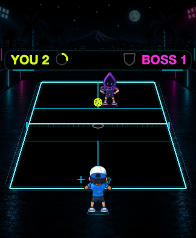 | 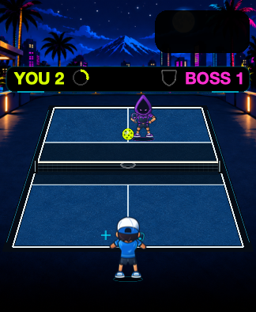 |

| Large before · build 7 renderer | Large after · selected B3 |
| --- | --- |
| 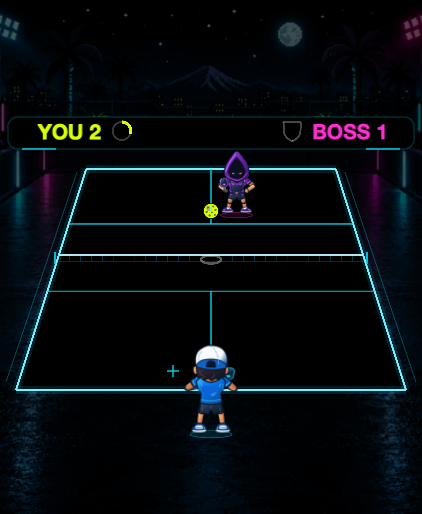 | 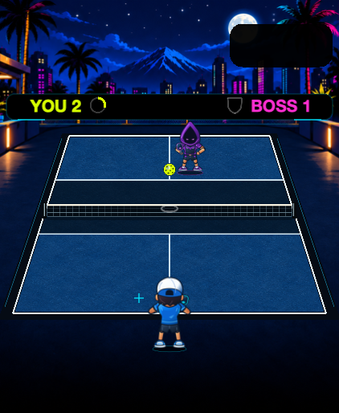 |

## All five bosses at the small layout

| The Wall | The Banger | The Poacher | The Dinker | The Lobber |
| --- | --- | --- | --- | --- |
| 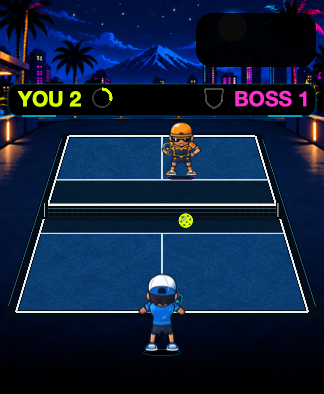 | 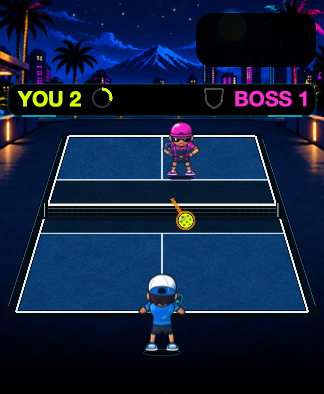 | 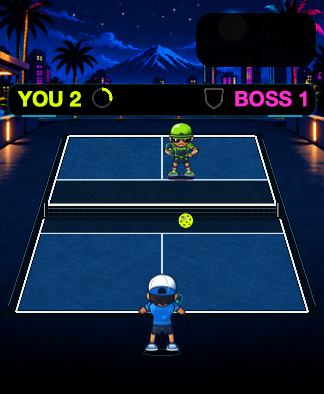 | 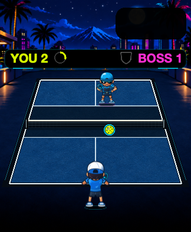 |  |

The complete small before/after rows are retained as original PNGs in this directory and in the self-contained comparison gallery. All screenshots were copied unchanged; HTML dimensions affect display only.

## What changed and what remains to validate

The new environment retains B palms, skyline and side architecture; native clock protection covers part of the authored moon. The court uses a separate blue acrylic material with a darker kitchen, precise native markings and a more readable woven net. The user explicitly selected the non-black blue surface. Lime ball, gray depth ellipse and cyan landing cross remain visible in the inspected Lobber fixtures.

All 1,626 approved character frames, registration metadata and animation timing remain unchanged. The existing character sprites are a visible difference from the generated concept's more detailed bodies and paddles. These captures do not establish animated contact quality or Watch frame pacing.

The full repository validation passed 282 Swift tests, including 69 renderer tests, and 62 importer tests. Exact-source hosted CI also passed unsigned Watch builds and six UI cases. Local focused navigation/results tests passed 4/4 on the large watchOS 27 simulator, 3/3 on the small watchOS 27 simulator and 3/3 on watchOS 10, with zero failures or skips. The large run also exercised Lobber rise/apex/descent pause and resume. Host measurements and physical validation have separate evidence. The screenshots alone make no GPU, memory, battery or sustained-play claim.

## Earned-save milestone animation

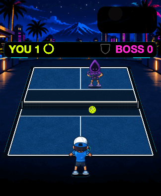

This is the actual shared renderer at synthetic 30 Hz input, with a held 20-return fixture. The GIF demonstrates presentation only; it does not measure frame pacing or natural rally reachability. Native clock and Pause are omitted.

## Capture identity

- Before: exact source commit `84b9e0f4739059eb14446f0f6c38f6485d8683f5`.
- After: exact runtime source `e45c612bcfc44922aa4897b42c16085b225eab6a`; the [manifest](manifest.json) records image hashes and capture methods.
- Final before/after fixture helper SHA256: `96f7c2573c988da2fe70617f660f293c4b37c7818ed51c90e9e4a8ac706589ef`.
- Scene SHA256: `eb19fddde7b270a82e6138aac8f023b9ca5a0449bb1221afa1934fb64837c0f4`.
- Court SHA256: `6ba13e477e903f3cdf078ffd13056deb764f1356edc83488940dde3e829f8fad`.

See the [selected court concepts](../b-court-directions/README.md) and [production asset provenance](../../../ArtSources/Backgrounds/B3/README.md) for the distinction between concepts and runtime layers.
