# PickleBlast visual comparison

Actual Watch simulator screenshots, unretouched. Baseline `b470aae`; polish implementation `77d0062`. Clock times differ. Gameplay screens use visual fixtures; the boss fixture uses the Arcade boss HUD. These images do not establish physical Watch performance or user acceptance.

### Large display · Home menu

| Build 5 · before | Build 6 · after |
|---|---|
| 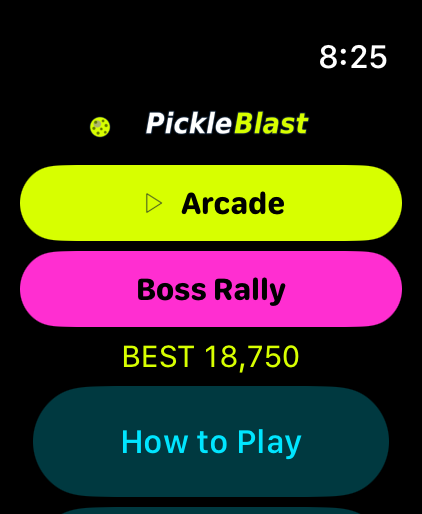 | 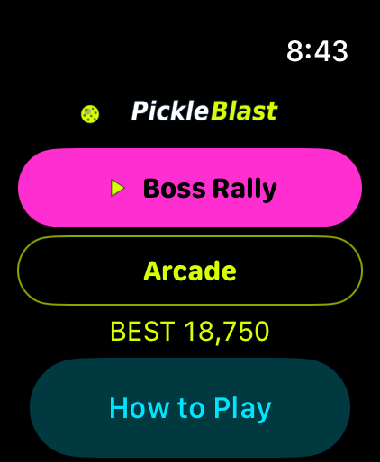 |

### Large display · Boss court fixture

| Build 5 · before | Build 6 · after |
|---|---|
| 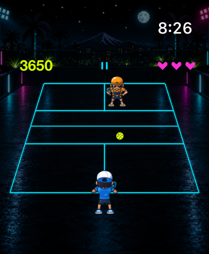 | 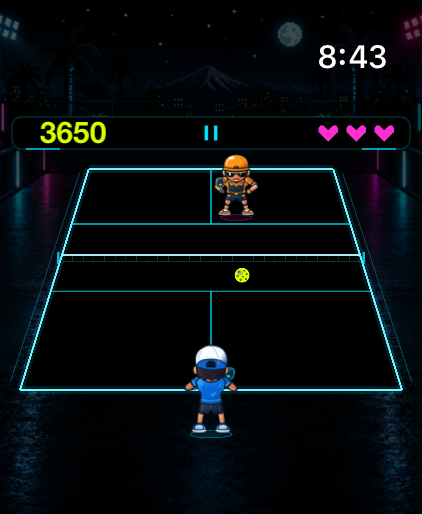 |

### Large display · Arcade court fixture

| Build 5 · before | Build 6 · after |
|---|---|
| 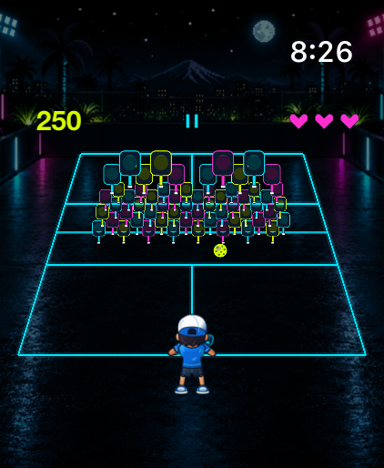 | 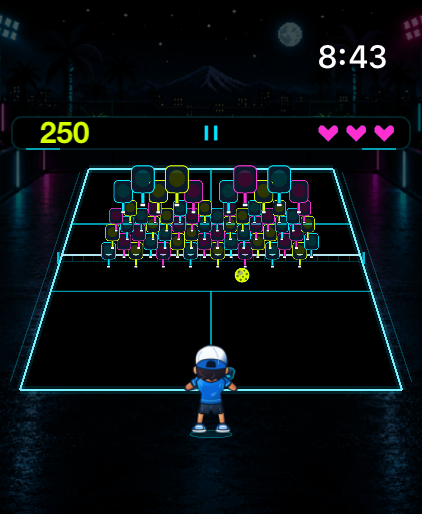 |

### Small display · Home menu

| Build 5 · before | Build 6 · after |
|---|---|
| 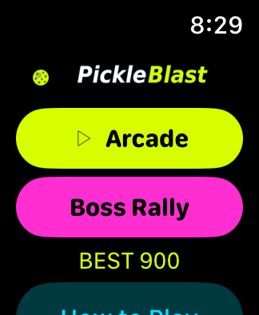 | 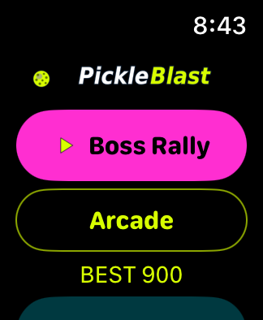 |

### Small display · Boss court fixture

| Build 5 · before | Build 6 · after |
|---|---|
| 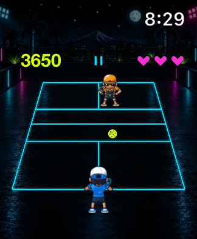 | 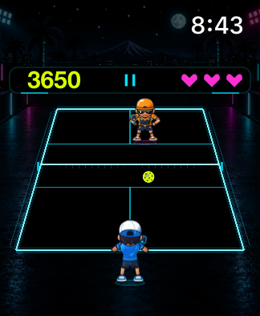 |

### Small display · Arcade court fixture

| Build 5 · before | Build 6 · after |
|---|---|
| 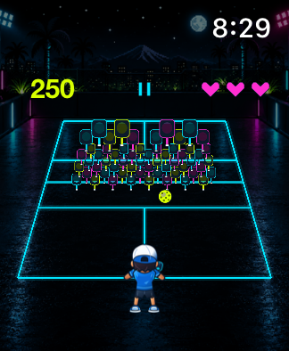 | 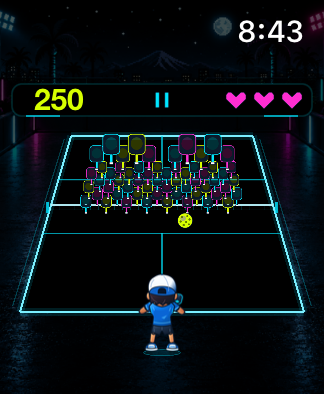 |
