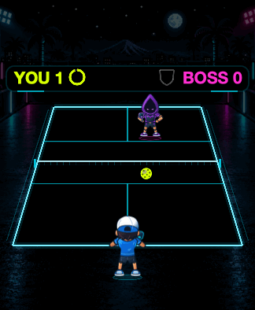
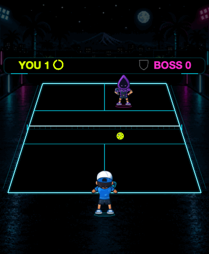
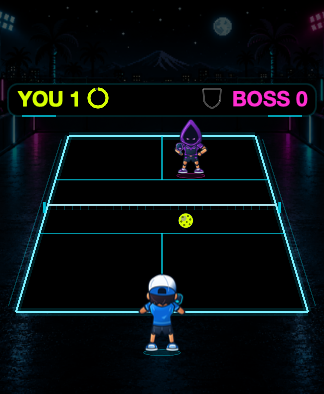
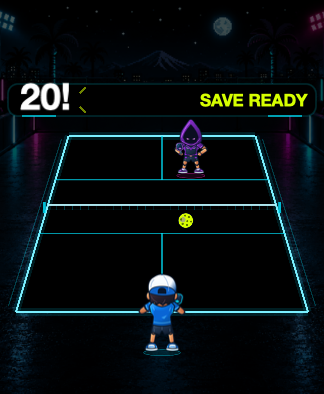
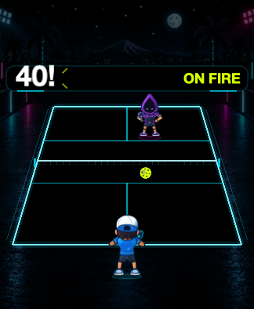

# Build 7 earned-save and milestone prototype

These images use the **actual shared SpriteKit renderer**, with the final boss-clearance adjustment. They are native macOS offscreen fixtures at the measured Watch layouts, not live Watch screenshots. Player, Lobber and ball state are held to make the HUD readable. The native clock and SwiftUI Pause control are outside this renderer-only capture.

Boss Rally starts with no save. Twenty consecutive **player** returns within one rally earn one save; only one can be held. Points and misses reset the streak, and an unused save survives a won point. Retry and the next boss start empty. Existing two-sided rally records and Arcade rules remain unchanged.

## Animated feedback

The normal HUD has a progress ring and one save shield. A 1.3-second milestone replaces the scores temporarily, above the court. Reduced Motion conveys the same information without the bounce or spark accents. GIF playback is not a frame-timing measurement.

| Actual renderer · normal motion | Actual renderer · Reduced Motion |
| --- | --- |
|  |  |
|  |  |

## Quiet progress and milestones

| Small · 19 player returns | Small · 20 player returns | Small · 40 player returns |
| --- | --- | --- |
|  |  |  |

All five bosses’ approved animation frames were checked for clearance at legal court extremes and paddle reach, including the milestone’s largest overshoot. The final font size and raised anchor remove the overlap caught by that check. Ball position, character artwork, contact geometry and animation timing are unchanged.

[Source and image hashes](manifest.json) · [Measured host costs and limits](../../PERFORMANCE.md) · [Separate visual concepts](../visual-directions/README.md)

The detailed art concepts have not been integrated. No build 7 installation or acceptance is implied by these captures.
