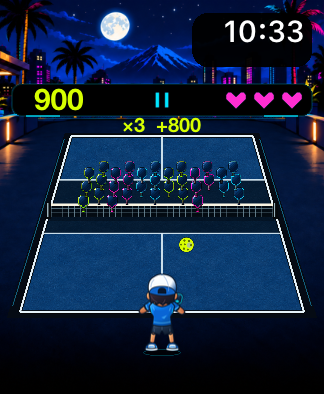
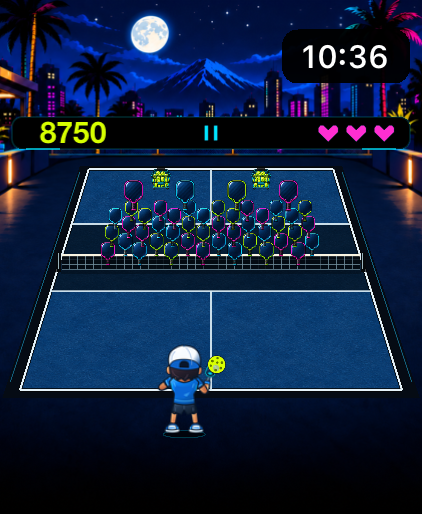
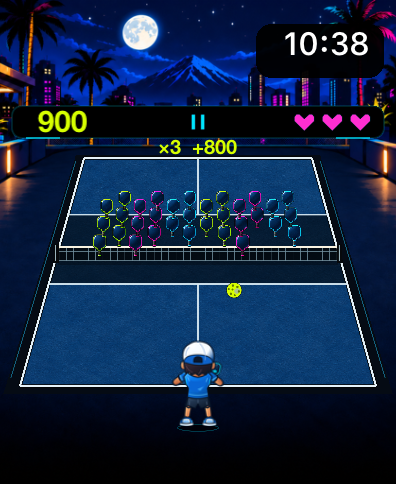
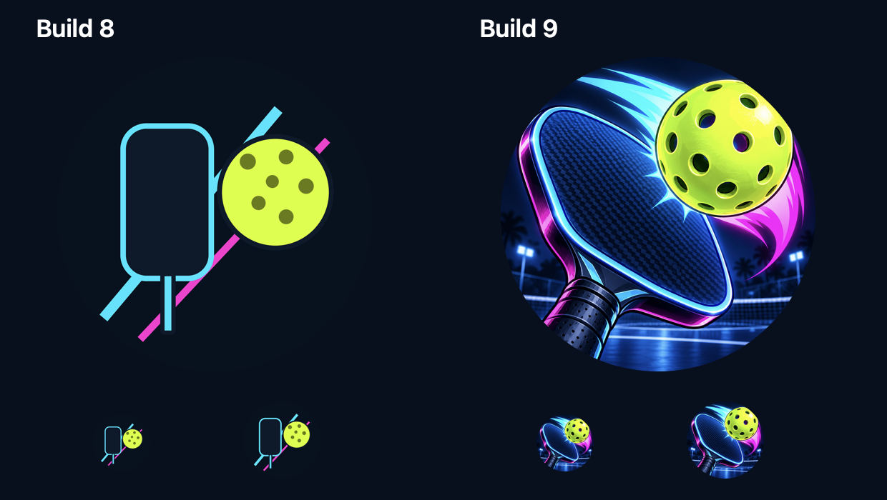
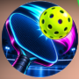
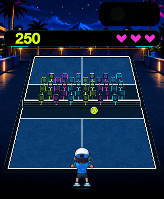
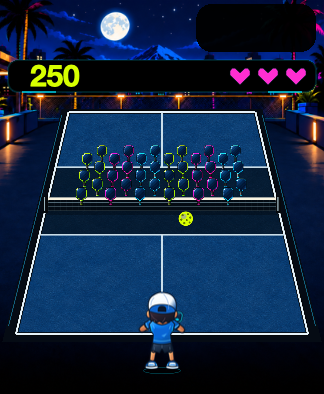
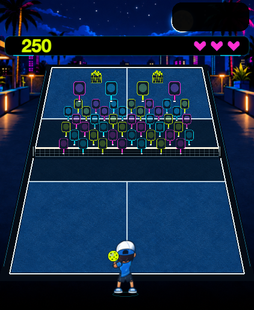
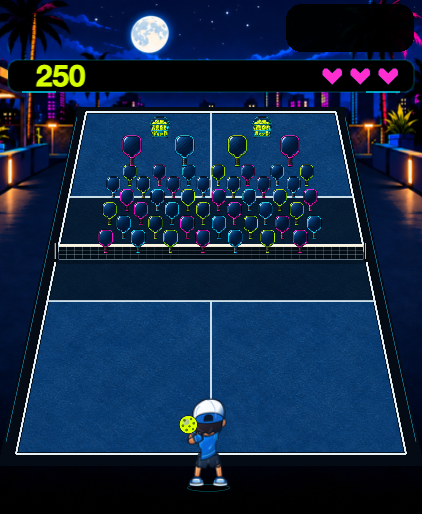

# Build 9: moon, Watch icon and Arcade production pass

The unmerged iteration is development version **1.0 (9)**, runtime commit `0b39a0ca4cc95cd5b8a2d7e7f8d4089857479644`. Build 8 (`e45c612`) remains the before baseline. Main is unchanged. [Draft PR #2](https://github.com/fcw1987/PickleBlast/pull/2) and the passing [exact-head CI](https://github.com/fcw1987/PickleBlast/actions/runs/37350093327) track the candidate.

## Changes

The single moon moves left of the native system clock. The clock stays in its system location with readable contrast. Original cel-shaded paddle/ball artwork replaces the flat Watch icon in all sixteen required slots. Arcade gets six original equipment sprites, bounded 0.30-second hit recoil, and expansion/dissolve of its existing pooled impacts. Logical target centers/radii, ball visibility, character contact frames, court lines, Crown calibration and match balance remain unchanged. No dependencies, nodes, actions, shaders or particles were added. Reduced Motion uses static hit/damage feedback; paused scene time freezes feedback.

Winning a Boss Rally point preserves the player-return streak, progress and pending save threshold across the next serve. Misses, including consumed saves and lost points, reset the streak as penalties. Retry/new match/Play Next reset it; pause and positive points do not. Focused tests cover nineteen → won point → twenty, continued forty-return thresholds, capped savings/no duplicate awards, misses, pause and new matches. Historical per-point rally statistics remain separate.

## Native compiled Watch evidence

These are actual simulator app screenshots, with compiled atlases, native clock and Pause overlay. The large Arcade captures use a DEBUG public-input oracle to advance genuine waves; no target, score or stage snapshots are injected. Ordinary small and watchOS 10 captures use a normal launch and real centered return. Screenshots are not performance measurements or physical Watch images.

| Small watchOS 27 | Large wave 2 | Older watchOS 10 |
|---|---|---|
|  |  |  |

[Large wave 1](images/native-large-wave1.png), [large wave 3](images/native-large-wave3.png).

## Icon at launcher size

The comparison includes 40pt and 54pt circular masks at 2× pixel density and an enlarged view. The unscaled native 90×90px crop is from the actual small Watch launcher. After an in-place simulator update, the first launcher capture showed its stale old icon; a reboot of that dedicated simulator preserved data and refreshed the cache. This final crop shows the new icon. The paired physical Watch also returned the correct non-placeholder installed icon at40pt/2× (80×80px), shown below. This is an OS icon-service result, not a physical launcher screenshot. Physical launcher appearance and gameplay remain user checks.

## Matched renderer-only before/after and feedback

These macOS offscreen captures use the same held renderer fixtures. They omit SwiftUI/native clock and Pause overlays; the black clock backing appears empty. Use the native screenshots above for clock visibility. GIFs sample supplied events at 30 Hz with held ball/targets and are art previews, not live play or measured frame pacing.

| Build 8 | Build 9 |
|---|---|
|  |  |
|  |  |

[Animated feedback](images/host-small-feedback.gif) · [Reduced Motion](images/host-small-reduced-motion.gif).

## Verification and measured costs

284 Swift tests (185 core, 70 renderer, 29 session), 63 importer checks, all required project/docs/site/privacy checks, unsigned Watch Release, and development-signed Release audit passed. Five selected UI cases across small/large watchOS 27 and watchOS 10 passed, plus the icon-specific cache-refresh repeat (six successful executions, zero failures/skips). All 1,626 character frames and contact metadata remain unchanged.

Three alternating fresh Release host processes per version cover 26 held fixtures; CPU runs use 120 warmup and 1,800 unpaced updates per fixture. Separate offscreen runs measure 60 SpriteKit renders plus CGImage readbacks per fixture. [Measurements](measurements.json) retain exact commit IDs, repeat counts, ranges and limitations.

| Measurement | Build 8 | Build 9 |
|---|---:|---:|
| Aggregate renderer CPU mean | 0.02840 ms | 0.02956 ms |
| Arcade fixture CPU mean | 0.07818 ms | 0.08424 ms |
| Offscreen render + readback mean | 18.086 ms | 18.111 ms |
| CPU-run host RSS median | 75.797 MiB | 62.938 MiB |
| CPU-run host RSS range | 63.078–75.891 MiB | 62.406–75.313 MiB |
| Offscreen-run host RSS median | 112.125 MiB | 109.813 MiB |
| Sparse / dense fixed nodes | 192 / 308 | 192 / 308 |
| Signed bundle | 18,386,670 bytes | 21,317,593 bytes |
| Compiled atlas RGBA inventory | 34,007,748 bytes | 34,055,052 bytes |

Overlapping host RSS ranges do not demonstrate a memory improvement. Bundle growth is 2,930,923 bytes; Assets.car grows 2,901,312 bytes, largely consistent with the icon catalog. Target atlas capacity grows 47,304 estimated RGBA bytes. Storage estimates are not resident device memory; mipmaps/framework allocation are excluded. Host PNG fallback excludes compiled Watch atlas load, core/SwiftUI, presented-frame timing and physical Watch GPU/RAM/energy/heat. This pass does not establish physical performance safety.

Original source and processing provenance live in `ArtSources/IconV1`, `ArtSources/ArcadeV1`, and `ArtSources/Backgrounds/B3/Build9`; source masters/tools stay outside the Watch bundle. No third-party art was imported. User acceptance remains pending; no App Store upload or enrollment/payment work.
