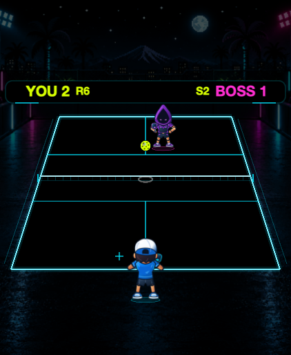
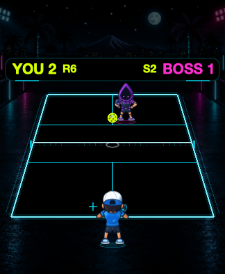
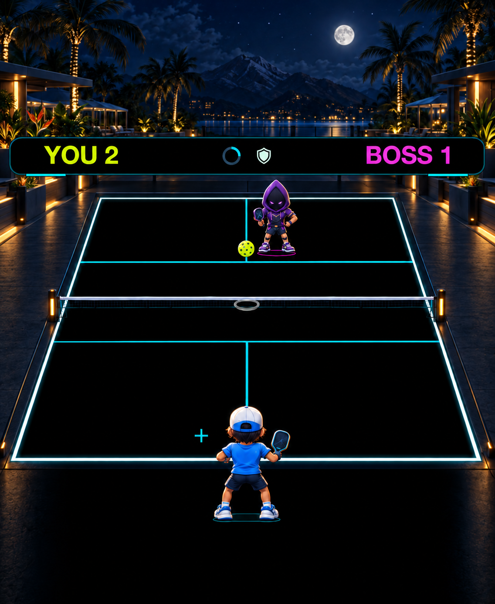
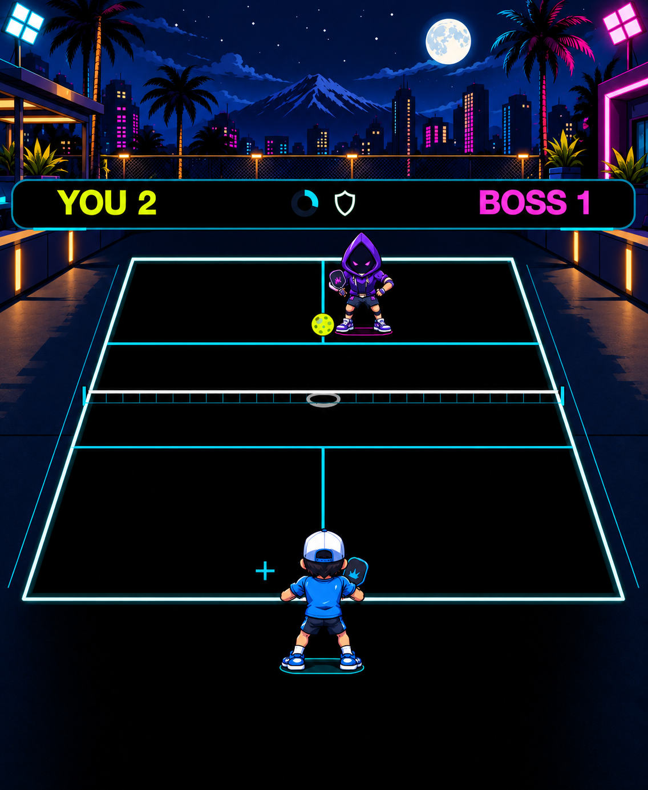
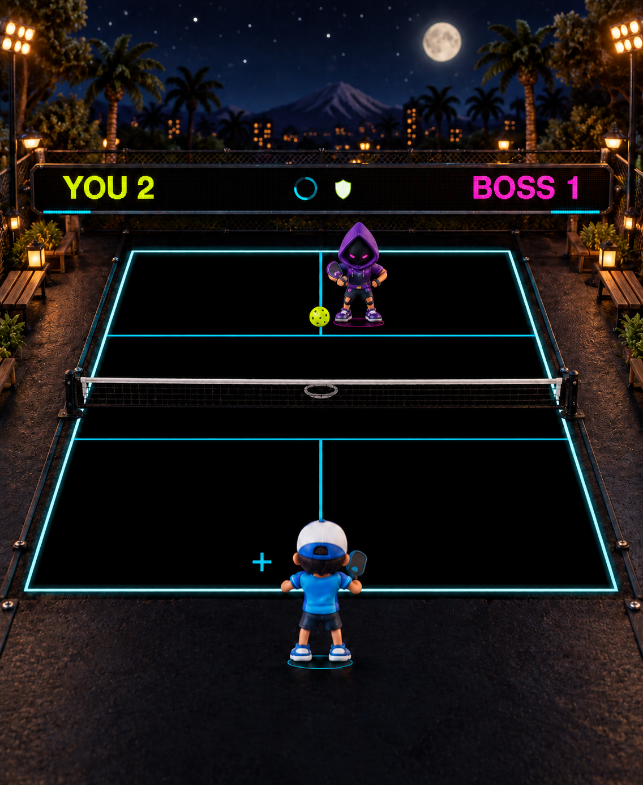

# Three visual directions for review

**A, B and C are original generated CONCEPT ART, not engine screenshots, production sprites or measured Watch performance.** The separate build 6 images are **ACTUAL IN-ENGINE** macOS SpriteKit fixture captures. The Watch remains on build 6. Choose a direction before full animation production or another Watch install.

[Open the gallery source](index.html) · [Proposed production budget](PRODUCTION-BUDGET.md)

The concepts share the representative Lobber rally, court camera, ball state and athlete identities. They replace the obsolete R/S text counters with a **concept-only** quiet progress-ring/shield treatment. The actual milestone HUD is being implemented and verified separately. Generated placement is approximate: these pictures cannot prove regulation geometry, exact RGB black, paddle registration or contact timing.

## Recommendation

**B — Cel Sports Comic** is the strongest first playable proof for tiny-screen readability. Its two-tone shading, clean cap/hood/paddle silhouettes and restrained net treatment should survive reduction better than fine material detail. That is an art judgment, not a measured performance result. **A — Painted Tournament** offers the strongest premium atmosphere and is a good alternative if that richness matters more. **C — Miniature Diorama** has the most distinctive tactile world, but its mesh, benches, granular materials and warmer surround need the most reduction to keep the ball dominant.

| Direction | Concrete art upgrade | Main production risk |
| --- | --- | --- |
| A — Painted Tournament | Dimensional painted-toon athletes, beveled paddles, warm/cool baked rim light, resort architecture and controlled court hardware | Fine costume/material detail can disappear at 40 mm; luminous perimeter scenery needs restraint. |
| B — Cel Sports Comic | Hand-inked silhouettes, broad two-tone athletic forms, graphic hood/cap/paddles, simplified urban arena | Background lighting must remain subordinate; all new poses must honor the existing contact contract. |
| C — Miniature Diorama | Sculpted clay/resin-like athletes, tactile equipment, miniature timber/metal surroundings and practical-light staging | The detailed net and warm ground texture can compete with the ball; do not implement physical 3D or dynamic lights. |

## Actual build 6 reference

These are unretouched shared-renderer fixture captures, not physical Watch photos. Left is 211 × 257 points at 2× pixels; right is the separately laid-out 162 × 197 point small viewport at 2× pixels.

| ACTUAL IN ENGINE — large | ACTUAL IN ENGINE — small |
| --- | --- |
|  |  |

## A — Painted Tournament · CONCEPT

## B — Cel Sports Comic · CONCEPT

## C — Miniature Diorama · CONCEPT

## 40 mm scale review

| ACTUAL IN ENGINE · build 6 | A · CONCEPT | B · CONCEPT | C · CONCEPT |
| --- | --- | --- | --- |
|  |  |  |  |

The HTML gallery displays **each complete concept** at 162 × 197 CSS pixels beside the actual small-viewport build 6 fixture. That is a static scale preview, not a separately reflowed or animated 40 mm engine capture; browser zoom and screen density also affect physical size. All three retain tiny faces. Better silhouette, color grouping and equipment edges must do the work: extra texture pixels alone will not make those faces readable. Final small-Watch art must be judged in the running game, especially Lobber descent and reaching contacts.

## What must stay authoritative

Keep the procedural RGB(0,0,0) court, exact regulation-line geometry, ball/cue positions and sizes, player/boss contact planes, animation timestamps and connected paddles. Do not flatten a concept into the runtime background. Apply the selected style to separated original raster assets, with lighting baked into them. No third-party runtime package or external artwork was added.

The [production budget](PRODUCTION-BUDGET.md) proposes a one-player/one-Lobber proof at the current 128 × 128 runtime frame size before completing every animation or boss. It explicitly separates compressed storage, decoded texture estimates, host timings and physical Watch validation.

## Provenance

Original concept images were produced with the built-in image generation tool from the actual build 6 Lobber fixture as a layout reference. The full [initial prompts](generation-prompts.json) and [targeted refinement prompts](refinement-prompts.json) are retained as generation records; rerunning them does not guarantee identical images. The final images were inspected after generation; they are not retouched with raster-editing scripts. `manifest.json` records selected-image dimensions and hashes. Existing game artwork and new project concept artwork remain covered by the repository [asset license](../../../ASSET_LICENSE.md).
